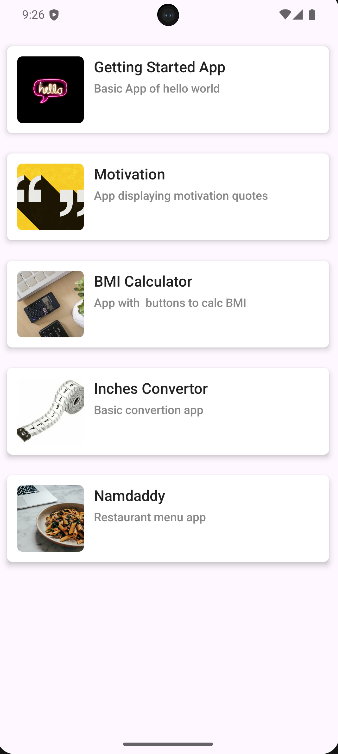

# 📱 ProjectLists

An Android app that showcases a collection of beginner-friendly projects.
The app displays projects in a scrollable list with their name, description, and icon.

---

## 🚀 Features

* RecyclerView-based project list
* Each project has:

  * 📝 Title
  * 📖 Description
  * 🖼️ Thumbnail/Icon
* Includes sample projects like:

  * Getting Started App (Hello World)
  * Motivation Quotes
  * BMI Calculator
  * Inches Converter
  * Namdaddy (Restaurant Menu App)

---

## 🛠️ Tech Stack

* **Language**: Java ☕
* **Framework**: Android SDK
* **UI Components**:

  * RecyclerView
  * Custom Adapter (`ProjectsAdapter`)

---

## 📂 Project Structure

```
app/
 └── src/
     └── main/
         ├── java/com/project/myprojects/
         │    ├── MainActivity.java
         │    ├── Project.java
         │    ├── ProjectsAdapter.java
         └── res/
              ├── layout/activity_main.xml
              ├── drawable/ (project icons)
              └── values/ (strings, colors, themes)
```

---

## 📸 Screenshots
<table>
  <tr>
    <th>Homescreen</th>
  </tr>
  <tr>
    <td></td>
  </tr>
</table>


---

## ▶️ Getting Started

1. Clone the repo

   ```bash
   git clone https://github.com/Notshreyasrbhat/Projectlists.git
   ```
2. Open the project in **Android Studio**
3. Build & Run on an emulator or physical device

---

## 📜 License

This project is licensed under the **MIT License** – feel free to use and modify.

---
